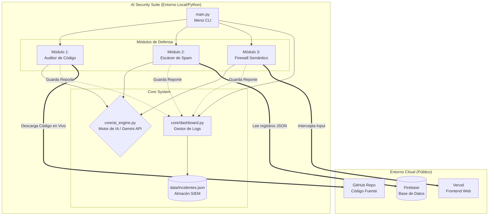

# 📚 Documentación del Proyecto: THE BARBER SHOP AI SECURITY SUITE
**Curso:** Summer Camp 2026
**Autor:** Ricardo
**Repositorio:** [github.com/ricardodevcorex99/PROYECTO-SUMMER-CAMP](https://github.com/ricardodevcorex99/PROYECTO-SUMMER-CAMP)

---

## 1. Definición del Problema
En el desarrollo de aplicaciones web modernas, la integración de Inteligencia Artificial (IA) en el lado del cliente (Frontend) expone a los sistemas a nuevas superficies de ataque que las herramientas de seguridad tradicionales no logran detectar de manera efectiva. 

En el proyecto **"THE BARBER SHOP"**, se identificaron dos problemáticas críticas al implementar un Chatbot VIP basado en Google Gemini API:
1. **Exposición de Credenciales (Credential Leak):** Los escáneres estáticos (como el Push Protection de GitHub) pueden ser evadidos mediante técnicas simples de ofuscación (como la partición y concatenación de cadenas de texto). Esto permite que las API Keys de producción terminen expuestas en el código fuente del cliente, abriendo la puerta a ataques de Denegación de Servicio (DoS) y robo de cuotas de facturación.
2. **Inyección de Prompts (Prompt Injection):** La falta de un canal seguro que separe las instrucciones del sistema (System Prompts) del input crudo del usuario permite que atacantes manipulen psicológicamente al modelo de lenguaje (LLM). Esto resulta en la extracción de datos sensibles o la alteración del comportamiento del chatbot, dañando la reputación del negocio.

Para mitigar esto, se hizo necesaria la construcción de una **AI Security Suite**, un sistema de ciberseguridad modular basado en Python capaz de realizar auditorías semánticas en tiempo real, escanear bases de datos (Firebase) y actuar como un Firewall Semántico para bloquear ataques de Prompt Injection.

---

## 2. Registro de uso del Copiloto (IA)
Durante la conceptualización y desarrollo de la Suite de Seguridad, se utilizó un Asistente IA Avanzado (Copiloto) para acelerar el desarrollo y garantizar la aplicación de las mejores prácticas de Ciberseguridad (OWASP).

**Fases de Intervención del Copiloto:**
- **Fase de Diagnóstico:** El Copiloto analizó el repositorio original en Vercel/GitHub e identificó que la API Key en `chatbot.js` era un vector de vulnerabilidad crítica (CVSS 9.3).
- **Fase de Desarrollo (Refactorización Modular):** El asistente ayudó a diseñar la arquitectura del software en Python, dividiendo el script monolítico en un ecosistema profesional (`main.py`, `core/`, `modules/`, `data/`).
- **Implementación del SIEM (Dashboard):** A partir de un requerimiento del desarrollador, el copiloto generó la lógica para el almacenamiento persistente de vulnerabilidades (`incidentes.json`), creando un Dashboard Centralizado de Gestión de Incidentes.
- **Fase de Seguridad de Entorno:** El copiloto configuró las exclusiones necesarias en `.gitignore` para prevenir la fuga accidental de credenciales (`.env`), demostrando la aplicación práctica de mitigación de fugas (Secret Scanning).

---

## 3. Diagrama de Arquitectura de la Solución

El siguiente diagrama muestra la arquitectura de la "AI Security Suite" y su integración con los ecosistemas de Vercel, GitHub y Firebase.

